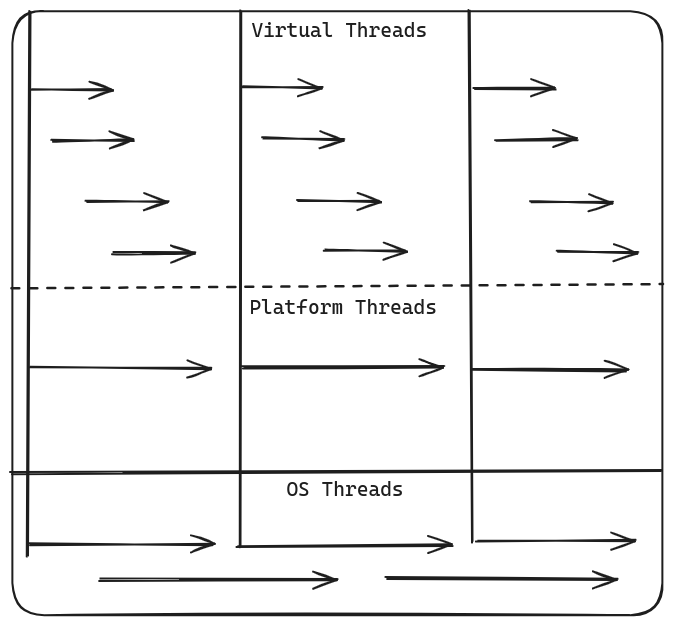
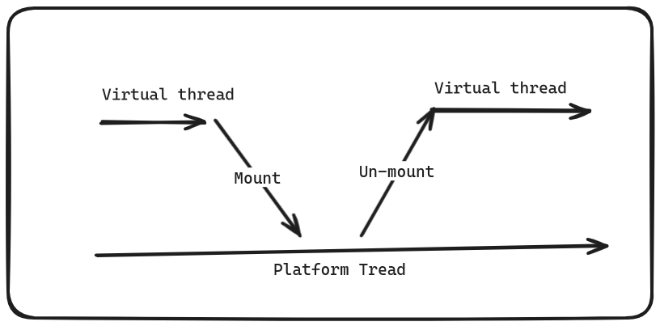

# Virtual threads

## Operating System threads
### OS threads are provided by OS to perform tasks

## Platform threads or Threads
### Threads present in java over a long time.
### Platform threads are thin wrapper over the OS threads.
### When JVM wants to create platform thread, it requests OS to create os thread.
### This OS thread only can create platform thread.
### OS thread and platform thread are in one-to-one mapping.
### Creating platform thread is intensive task,we put them in pool.
### Instead of killing thread we put them into Thread Pool, so that we can use it from the pool whenever we need it .

## Virtual Threads
### Very light-weight user threads, requires less memory.
### As it requires less memory we can create them in huge number.
### Due to this reason virtual threads are highly scalable.
### No thread pooling needed.
### Pooling virtual threads is anti pattern.
### Virtual threads can not execute task on its own, it needs platform thread help to do tasks.

## Virtual thread Scheduler

### It mounts virtual thread on to a platform thread, when virtual thread requires platform thread.
### it un-mounts virtual thread on from a platform thread, when virtual thread no longer requires platform thread.
### When virtual thread waiting for resource to be available, database response or IO call at that time virtual thread does not need platform thread.
### During this time as it virtual thread scheduler un-mounts virtual thread from plat from thread, CPU is not blocked and can be used for other tasks.
### Using virtual threads CPU is efficiently utilized.

## Continuation
### Continuation can be seen as representation of current state of a program.
### It allows us to pause or resume program at any point of time.

[author-repo](https://github.com/balkrishnarawool/continuations)

